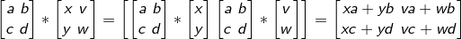
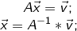
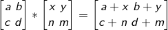
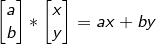
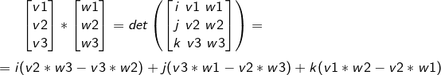
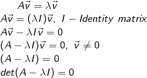
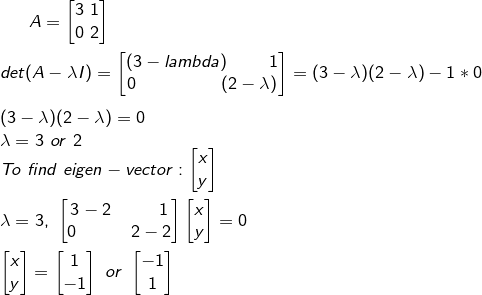

## Basic

**Вектор / Vector** - преобразование в пространстве (преобразование аргументов)

**Скаляр** - масштабирует вектор (2 - удвоение)

**Сложение векторов** - Суммой двух векторов u и v называется третий вектор w, проведенный из начала u к концу v, если начало вектора v совпадает с концом вектора u. Сложение векторов выполняется по правилу треугольника или по правилу параллелограмма. w=u+v
Это последовательное преобразование, сначало первого вектора, потом второго, в результате получаем новый вектор.

**Basic vectors (базис)** - набор векторов в векторном пространстве, такой, что любой вектор этого пространства может быть единственным образом представлен в виде линейной комбинации векторов из этого набора. Векторы базиса называются базисными векторами. 
Это основные(начальные) векторы в которых происходит преобразование. Еденичные векторы (i,j). Определяют систему координат.

Любой вектор может быть представлен линейной комбинацией basic vectors

**Линейная комбинация** - выражение, построенное на множестве элементов путём умножения каждого элемента на коэффициенты с последующим сложением результатов
av + vw

**Span** (размерность) - все возможные линейные комбинации.
В двухмерном пространстве av + bw двух векторов (если они не лежат на одной линии), span - это вся плоскость. Комбинацией a и b можно достать до любой точке в пространстве. Для одномерного массива - это все точки на прямой.

**Линейное преобразование**
Это функция которая берет вектор как аргумент и возвращает преобразованный вектор. При линейном приобразовании изменяются basic vectors. Тоесть вектор который преобразовывается переходит в новую систему координат (с новыми базисными векторами)

- геометрически - преобразование при котором все линии остаються паралельны и равноотдаленны, а начало координат не меняется.

- мат:
	- L(v+w) = L(v) + L(w) - additivity (адативность)
	- L(c*v) = c * L(v) - scaling (однородность)
	

(a b) * (x) = x*(a) + y*(b) = (xa+yb)
(c d)   (y)     (b)     (d)   (xc+yd) 

**Матрица** - это одно из возможных описаний линейного преобразования (для basic vectors), где столбцы - его координаты

**Умножение матриц / Matrix multiplication** - это последовательное преобразование, в результате получаем матрицу. Порядок имеет значение! Умножение выполняется с лева на право.

При умножении на матрицу, вторая матрица рассматривается как векторы (x, v), (y, w), которые преобразовываются первой матрицей (a b / c d).

**Линейная независимость / linear independent** - все вектора находяться в разных измерениях (не лежат на одной прямой)
a set of vectors is said to be **linearly dependent** if at least one of the vectors in the set can be defined as a linear combination of the others; if no vector in the set can be written in this way, then the vectors are said to be **linearly independent**.

### Детерминант

Детерминант - det - это кооэфициент определяющий во сколько раз измениться область (прямая, площадь, обьем ...) после преобразования. Знак детерминанта определяет было ли отражение при преобразовании.

Если det = 0, размерность матрицы уменьшается (плоскость -> в прямую или даже в точку), также это означет что в матрице есть линейно зависимые векторы.

**Rank** (rgA) - количество измерений  (по кол-ву колонок). Full Rank - когда все измерения используются, нет лин. зависимых векторов.

**Kernel** - пространство всех векторов, которые после преобразовани становяться нулевыми (схлопываются в начало координат)

**Inverse transformation** - обратное преобразование. Когда мы знаем какое было исходное преобразование (матрицу преобразования) и резуьтирующий вектор, то с помощью inverse transformation можем найти исходный вектор. (используется для решения лин уравнений)

**Non square matrix** - (m-by-n matrices for which m ≠ n) do not have an inverse. Трансформация между измерениями (2x3) - 2-х мерная мтраца представленная в 3-х мерном пространстве

**Сложение матриц**

**Транспонирование матриц** - столбцы становяться строками. При транспонировании det не меняется.

### Скалярное произведение / Dot product

Скалярное произведение - это преобразование в одномерное пространство. Определяется как произведение длинны вектора на проекцию второго вектора на него.

### Вектроное произведение /  Cross product
в результате получаем вектор перпендикулярный паралелограмму, с длинной равняющейся площади этого паралелограмма (det). Используется правило правой руки.

### Собственный вектор / Eigen vector 

Собственный вектор - вектор, который при преобразовании не меняет свое расположение, его span не меняется. Он только растягивается или сужается.

**Собственное значение / eigen value** - определяет на сколько растянулся или сузился собственный вектор после преобразования.

A - матрица, v - собственный вектор, Y - собственное значение
Преобразование вектора v матрицей А - ровнослиьно умножению вектора v на eigen value. (Так как собственный вектор при преобразовании не перемещается)

*Example*

**Eigen basis** - eigen vector становяться eigen basis когда он лежит на осях (Диагональная матрица)

**Diagonal matrix** - is a matrix in which the entries outside the main diagonal are all zero.

> img:diagonal_matrix

### Change basis vectors

Когда мы хотим перейти с одной сист. координат в другую. Изменить basis vectors для определенного преобразования.

> img:change_basis_vectors

М - матрица преобразования
А - basis vectors

> img:change_basis_vectors_example

*Коментарий:* тоесть чтобы выполнить преобразование матрицей М, но в новых координатах, новые basis vectors, мы можем умножить нашу матрицу М на A^-1 * M * A, где А - это матрица из eigen vectors. Но это не всегда возможно, так как должны быть хотя бы два eigen vectors.

--

Функции тоже могут быть линейными, тоесть выполнять линейное преобразование. Например производная - это линейное преобразование.

> table:lin_algebra-functions