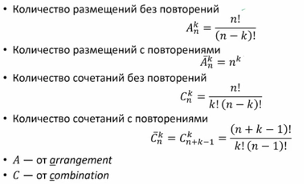
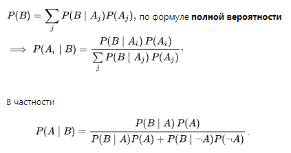
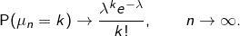
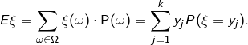
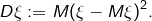
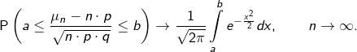

# Классическое понятие вероятности

Ω = {ω1, ω2 …, ωn} – пространство элементарных событий (все возможные события (пример Кубик Ω = {1,2,3,4,5,6} )

ω – элементарное событие (один из вариантов из пространства эл. событий)

А – случайное событие, А ∈ Ω

A∪B -  обьединение, или А или В, A∩B – пересечение, А и В
p1, p2 ... , pn >= 0 (pn - вероятность элем. события ωn)
p1+p2 + ... + pn = 1 (сумма вероятностей все эл. событий равна 1)

**Вероятность события** - P(A) = SUM(pk) , k: ωk ∈ A

### Свойства вероятности:
- P(0) = 0, P(Ω) = 1
- 0 <= P(A) <= 1
- If A∩B = 0, P(A∪B) = P(A) + B(B)
- P(A∪B) = P(A) + B(B) - P(A∩B)
- P(A∪B) >= P(A) + B(B)
- P(BnotA) = 1 - P(A)

При p1 = p2 = ... pn = 1/n  (все события равновероятны)

`P(A) = #A / #Ω`  (количество эл событий в А на кол всех эл событий)

## Элементы Комбинаторики

> Бином Ньютона. Следствие.
> Полиномиальная формула. Следствие.
 
# Условная вероятность / Conditional Probability

`P(A|B) = P(A∩B) / P(B)`  

**Теорема умножения**  (из условной вероятности)
`P(A∩B) = P(A|B) * P(B)`

**Независимость событий** -   события независящие друг от друга, условие 
`P(A∩B) = P(A) * P(B)`

Независимость в совокупности (события между собой могут быть независимы но в совокупности зависимы):
`P(A∩A1∩...∩An) = P(A1) * P(A2) * ... * P(An)`

**Полная вероятность** (разбиваем множество эл. исходов В на части и считаем вероятность множества эл. исходов А, которая находиться в В )
`P(A) = SUM( P(A|Bi) *  P(Bi))` 

*Пример:* Расчитать вероятность того что в комнате включен свет P(light), зная вероятность наличия света когда я сплю P(sleep). Множество эл. исходов А - свет включен или выключен, В - сплю я (sleep )или нет (-sleep). P(-sleep) = 1 - P(sleep)
P(light) = P(ligth|sleep) * P(sleep) + P(light|-sleep) * P(-sleep) 

## Теорема Байеса / Bayes’s Theorem

**Формула Байеса**
(из теоремы полной вероятности и условной вероятности - P(A∩B) = P(A|B) * P(B) , P(B∩A) = P(B|A) * P(A), P(A∩B) = P(B∩A) => P(A|B) * P(B) = P(B|A) * P(A) )

`P(A|B) = P(B|A) * P(A) / P(B)`

*где P(A) - априорная вероятность гипотезы A*

*P(B) - полная вероятность наступления события B*

*P(A|B) - вероятность гипотезы A при наступлении события B (апостериорная вероятность);*

*P(B|A) - вероятность наступления события B при истинности гипотезы A;*

*Additional materials
https://www.coursera.org/learn/probability-theory-basics/lecture/lk0Ne/formula-baiiesa

https://neurohive.io/ru/osnovy-data-science/kak-primenjat-teoremu-bajesa-dlja-reshenija-realnyh-zadach/

http://baguzin.ru/wp/den-morris-teorema-bajesa-vizualnoe-vvedenie-dlya-nachinayushhih/*

# Дискретные Случайные велечины  / Random Variables

Случайная велечина (дискретная) - вещественнозначная функция, определенная на множестве Ω. ξ:Ω⟶R
Пусть дано некоторое вероятностное пространство (Ω,P),то есть задано множество элементарных исходов Ω, на котором заданы вероятности всех эл. исходов. Силуч. велечина - это функция которая определяет значение эл. исхода. Важно отметить, что на каждом конкретном элементарном исходе ω случайная величина принимает вполне определенное значение ξ(ω). 
Дискретная случ величина принимает счетное множество значений А = {y1, y2 ... , yn}, c вероятностью p1, p2 ..., pn, сумма этих вероятностей равна 1. Тоесть значениям ф-ции поставленны в соответсвия распределение вероятностей эл. событий.

*Пример:* игральная кость, при этом случайной величиной может быть любая ф-ция, например:
ξ(ω)=ω^2, то есть если выпадит 2 - случ. величина = 4;  
ξ(ω) = 1, если четное значений; 2, если нечетное.
Вероятность того что случ. вел равна yi равна pi   P(ξ=yi) = pi

**Распределение случ. вел.** -  значение всех вероятностей того, что ξ принимает какое-то возможное значение ai

**Независимые случ. вел.**

Пусть даны две случайные величины ξ,η:Ω→R. Причем ξ принимает значения из множества {x1,…,xn} , а η — из множества {y1,…,ym}
Говорят, что случайные величины ξ и η независимы, если: P(ξ=xi,η=yj) = P(ξ=xi)⋅P(η=yj). Вероятность пересечение равна произведению вероятностей.

### Типы дискретных случ велечин:

- Cлуч вел. с двумя исходами.  Описывается распределением Бернулли P(X = 1) = p; P(X = 0) = 1 - p, X ~ Ber(p)
**Схема исп. Бернулли**: Проводятся  опытов, в каждом из которых может произойти определенное событие («успех») с вероятностью p (или не произойти — «неудача» — с вероятностью q = p-1). Задача — найти вероятность получения ровно m успехов в этих n опытах. Рассматривается при условии что вероятности эл. событий не равновероятны, как в классической схеме.

- Cумма независимых бинарных случ. вел, описывается биномиальным распределением P(X = n) = p^n, X ~ Bin(n; p):
- Cчетчики - описывается распределением Пуасонна X ~ Pois(_):

## Мат. Ожидание / Expected value -  
Математическое ожидаение случайной вел. это некое среднее значение или среднее ожидаемое значение - взвешенная сумма произведений каждого значения случ. вел. на его вероятность (в случае класической схемы это среднее арифметическое, так как вероятности равновероятны). Обозначаеться E  en (expectation) или M ru (mean)
Важно, что математическое ожидание может не принадлежать множеству возможных значений случайной величины.

ξ(ω) - значение случ. вел. 
P(ω) - вероятность эл. события

### Свойства:
- ξ >= 0 => Eξ >=0 
- E(aξ + bη) = aEξ + bEη
- E(ξη)^2 = Eξ^2 * Mη^2
- ξ и η независимы, если E(ξη) = Eξ * Eη

*Медиана Me* - медианой случайной величины ξ называют то ее значения, для которого выполняются равенство вероятностей событий, то есть, плотность вероятностей справа и слева одинаковы и равны половине (0,5)

## Дисперсия / Variance  
Дисперсия -  случ величины позволяет оценить разброс случайной величины относительно её среднего значения, то есть найти среднеквадратичное отклонение ξ от своего среднего значения.

### Свойства:
- Dξ >= 0
- Dξ = E(ξ^2) - (Eξ)^2
- D(ξ+a) = Dξ
- D(c*ξ) = c^2 Dξ 

**Дисперсия суммы**

D(ξ+η) = Dξ + Dη + 2( E(ξη) - Eξ * Eη )
D(ξ+η) = Dξ + Dη , если случ. вел. независимы

**Ковариация**

cov( ξη ) = E( (ξ - Eξ) * (η - Eη) )

**Коэффициент корреляции / Correlation coefficient** -  мера линейной зависимости двух случайных величин

r( ξη ) = cov( ξη ) / sqrt(Dξ) * sqrt(Dη)

### Неравенство Маркова
`P(ξ≥a)≤Eξ / a`

### Неравенство Чебышова
`P|η−Eη| ≥ b ≤ Dη / b^2`

## Непрерывные Случайные велечины 
Так как в конкретной точке вероятность равна нулю, поэтому непрерывную случ. вел. нельзя определить функцией вероятности. Для этого используются функция распределения или функция плотности распределения

*Непрерывное распределение - распределение случайной вещественной величины, принимающей значения, принадлежащие интервалу [a, b], характеризующееся тем, что плотность вероятности на этом интервале постоянна.*

**Функция распределения** F(x) = P(X <= x):  x=[0:1]

**Плотность распределения** - такая функция интеграл которой равен вероятности того что случ. вел. попадает в отрезок (на котором определен интеграл)
Итеграл функции плотности распределения = функции распределения

*Типы непрерывных случ. вел:*
- **равномерная случ. вел** X ~ U(a; b): (равномерное распределение)

- **нормальное распределение** X ~ N(m, sigma^2). Также называемое распределением Гаусса или Гаусса — Лапласа — распределение вероятностей, которое в одномерном случае задаётся функцией плотности вероятности, совпадающей с функцией Гаусса.
Функция плотности

# Закон больших чисел

P(|Sn/n - p| >=  ε)  --> 0 , при n --> oo

## Теорема Муавра - Лапласа (интегральная теорема)**

# Центральная предельная теорема
Случайная вел. определенная как среднее большого числа независимых и идетнично распределенных случ. вел. , сама является нормально распределенной

> Геометрическая вероятность

> Метод Монте-Карло

> Сигма-алгебра событий
